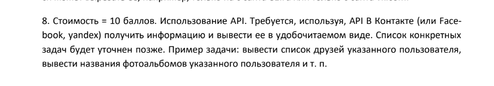

# VK-API

## Постановка задачи



## Как запускать
```
.\ВК-апи\ python main.py <command> <user>
```

## Список команд

***friends*** - выводит список друзей указанного пользователя  
  
***albums*** - выводит список альбомов указанного пользователя

***groups*** - выводит список групп указанного пользователя

## Что вводить в поле \<user>

Можно вводить теги пользователя:
```
.\ВК-апи\ python main.py friends f4rwll
```

Можно вводить id пользователя:
```
.\ВК-апи\ python main.py groups 12345678
```

## Наглядная работа

Можно посмотреть [тут](https://drive.google.com/file/d/1hXxrAW9toVJgKPFTS-84opGWy-eWX4ik/view?usp=sharing)